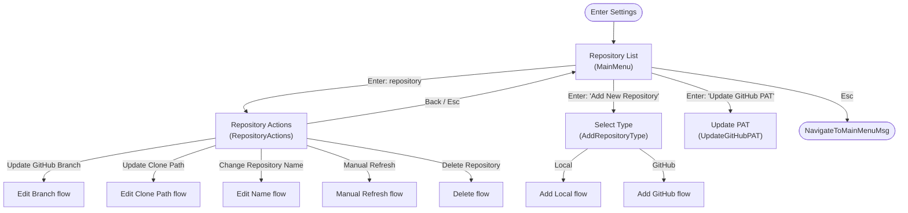
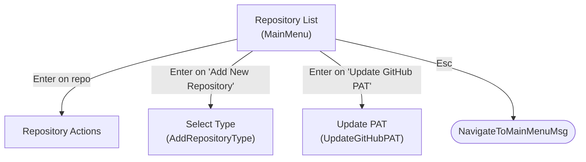
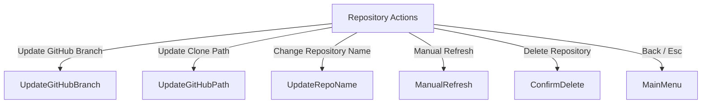
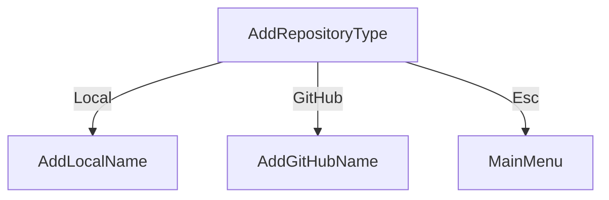
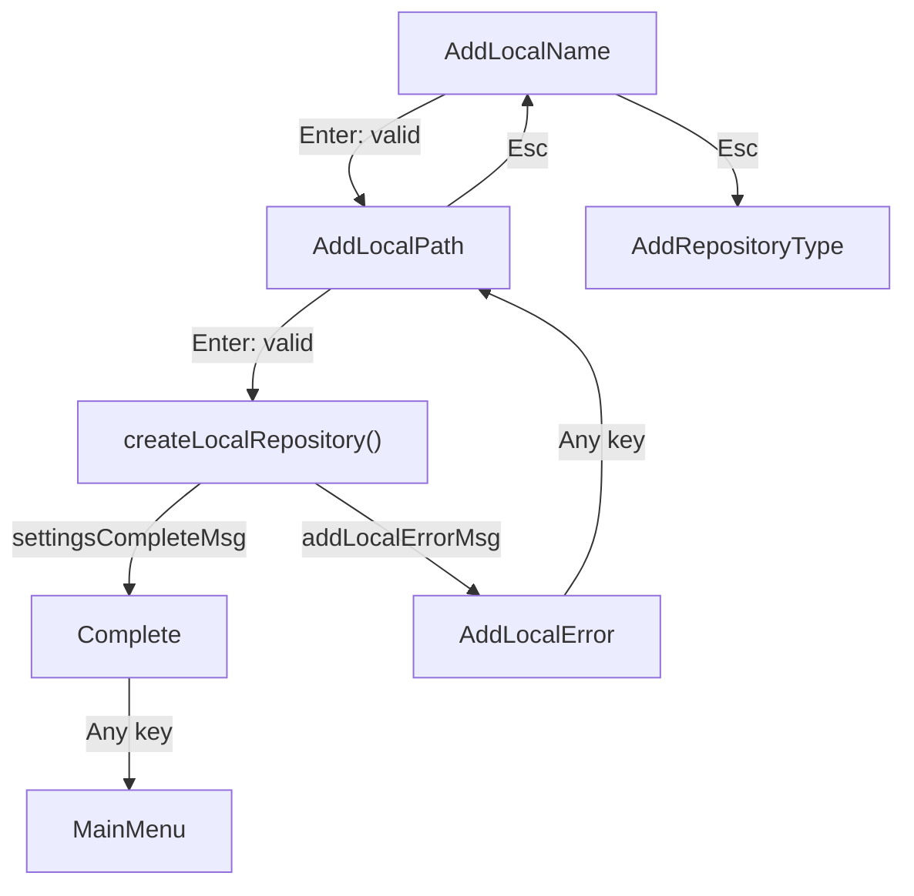
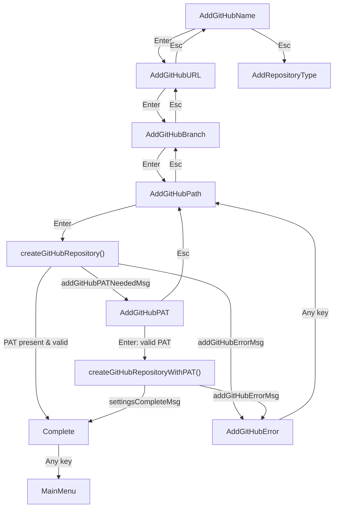
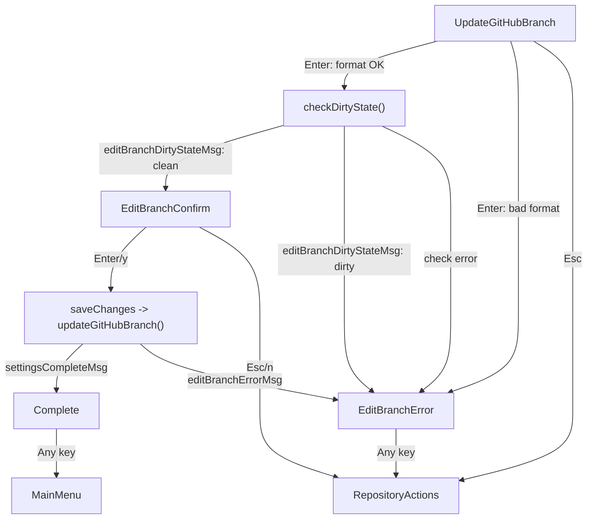
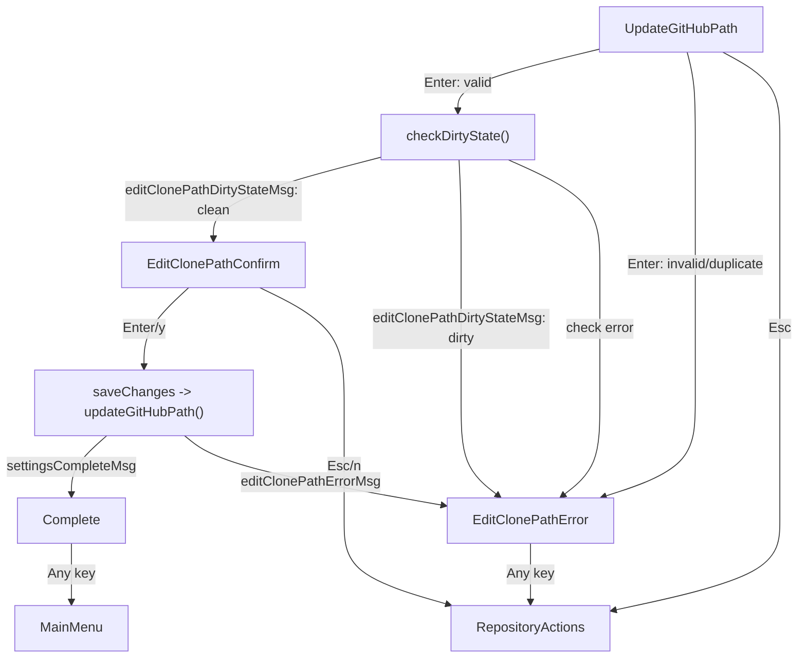
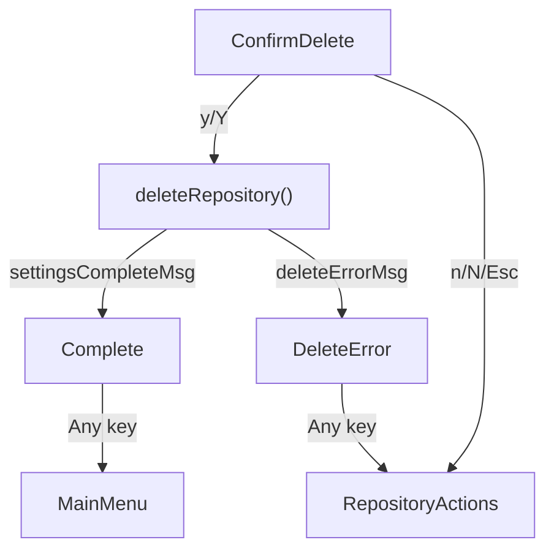
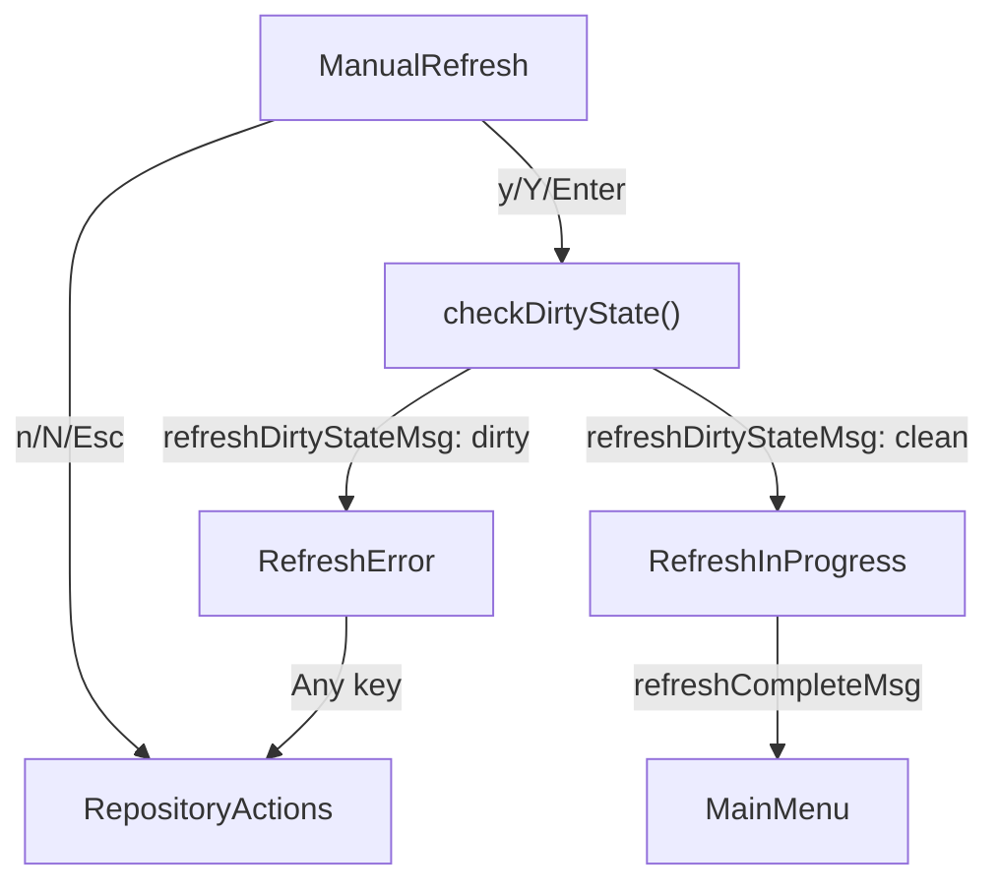

# Settings Menu (`settingsmenu`)

Developer reference for the rulem Settings Menu — the Bubble Tea component that lets a
user manage their configured rule repositories: list them, add new ones (Local or
GitHub), rename them, edit GitHub branch / clone path, manually refresh a GitHub clone,
delete a repository, and update the global GitHub Personal Access Token (PAT).

The entry point is `SettingsModel` in `settingsmenu.go`, constructed by
`NewSettingsModel(ctx helpers.UIContext)`. It implements the standard
`tea.Model` interface (`Init`, `Update`, `View`).

---

## Purpose and responsibilities

- Present all configured repositories (`ctx.Config.Repositories`) plus two action items
  ("Add New Repository", "Update GitHub PAT") in a single list.
- Drive a set of **self-contained per-flow** editing/creation journeys.
- Persist changes to the on-disk config (`config.Config.Save()`), refresh the prepared
  repository list, and trigger a parent config reload via `config.ReloadConfig()` on
  successful mutations.
- Store the GitHub PAT in the system keyring through a `credentialManager`.

The model returns control to the parent by emitting `helpers.NavigateToMainMenuMsg{}`
(from the main menu on `esc`, or from the completion screen on any key).

---

## Architecture: mutually exclusive states

Each flow owns its own dedicated states — only `SettingsStateMainMenu` and
`SettingsStateComplete` are shared. This keeps `Update()` and `handleKeyPress()` flat
(a single `switch m.state`), avoids conditionals based on prior state, and makes each
flow independently testable.

Two cross-cutting mechanisms support this:

- **State transitions** go through `transitionTo(newState)`, which records
  `previousState`, clears the layout error (unless re-entering the same state), and
  resets `selectedRepositoryActionOption`. `transitionBack()` restores `previousState`.
- **Dirty-state checks** use a message-factory pattern. `checkDirtyState(msgFactory)`
  runs one async `git status` check and wraps the result in a flow-specific message so
  each flow reacts without inspecting shared state:
  - `editBranchDirtyStateMsg` → Edit Branch flow
  - `editClonePathDirtyStateMsg` → Edit Clone Path flow
  - `refreshDirtyStateMsg` → Manual Refresh flow

> Note: the delete flow intentionally performs **no** dirty check (see
> [Design notes](#design-notes)).

---

## State machine

`SettingsState` (see `types.go`) defines **30 states**, grouped by flow. `String()`
returns the short names used below and in log output.

| Group | States |
| --- | --- |
| Shared (2) | `MainMenu`, `Complete` |
| Add repository — type select (1) | `AddRepositoryType` |
| Add Local (3) | `AddLocalName`, `AddLocalPath`, `AddLocalError` |
| Add GitHub (6) | `AddGitHubName`, `AddGitHubURL`, `AddGitHubBranch`, `AddGitHubPath`, `AddGitHubPAT` (optional), `AddGitHubError` |
| Repository actions / Delete (3) | `RepositoryActions`, `ConfirmDelete`, `DeleteError` |
| Edit Branch (3) | `UpdateGitHubBranch`, `EditBranchConfirm`, `EditBranchError` |
| Edit Clone Path (3) | `UpdateGitHubPath`, `EditClonePathConfirm`, `EditClonePathError` |
| Edit Name (3) | `UpdateRepoName`, `EditNameConfirm`, `EditNameError` |
| Manual Refresh (3) | `ManualRefresh`, `RefreshInProgress`, `RefreshError` |
| Update PAT (3) | `UpdateGitHubPAT`, `UpdatePATConfirm`, `UpdatePATError` |

### Message types (`types.go`)

- `settingsCompleteMsg` — a repository mutation succeeded; `Update()` sets `Complete`
  and returns `config.ReloadConfig()`.
- `config.LoadConfigMsg` — carries a (re)loaded config; rebuilds `preparedRepos` and the
  list items.
- `refreshCompleteMsg{success, err}` — manual refresh finished. A non-nil `err` routes to
  `RefreshError`; success returns to `MainMenu`.
- Dirty-state results: `editBranchDirtyStateMsg`, `editClonePathDirtyStateMsg`,
  `refreshDirtyStateMsg`.
- Flow-specific errors: `addLocalErrorMsg`, `addGitHubErrorMsg`, `deleteErrorMsg`,
  `editBranchErrorMsg`, `editClonePathErrorMsg`, `editNameErrorMsg`, `updatePATErrorMsg`.
- `addGitHubPATNeededMsg` — Add GitHub flow needs an inline PAT entry.

### `ChangeOption` enum

`ChangeOptionManualRefresh`, `ChangeOptionGitHubBranch`, `ChangeOptionGitHubPath`,
`ChangeOptionChangeRepoName`, `ChangeOptionDelete`, `ChangeOptionAddNewRepository`,
`ChangeOptionGitHubPAT`, `ChangeOptionBack`. The repository-actions menu tags the delete
entry with `ChangeOptionDelete`, and `handleRepositoryActionsKeys` matches on it.

---

## High-level flow



`handleKeyPress` first intercepts the single global key (`ctrl+c` → `tea.Quit`) via
`isNavigationKey` / `handleNavigation`, then dispatches on `m.state`.

---

## Flows

### Main menu — repository list

**States:** `MainMenu` · **Handler:** `handleMainMenuKeys` · **View:** `viewMainMenu`

The list is built by `BuildSettingsMainMenuItems(preparedRepos)` (`helpers.go`), which
appends the two `SettingsActionListItem` entries after the repository items. `Init`
returns `loadCurrentConfig()`, which emits `config.LoadConfigMsg`.



On `enter`/`space`, `GetSelectedRepository` distinguishes a repository (store
`selectedRepositoryID`, go to `RepositoryActions`) from a `SettingsActionListItem`
(dispatch on its `Action`). Other keys are forwarded to the underlying `list.Model`.

### Repository actions

**States:** `RepositoryActions` · **Handler:** `handleRepositoryActionsKeys` ·
**View:** `viewRepositoryActions` · **Options:** `getMenuOptions`

A custom `up`/`down`/`enter` menu (not single-letter shortcuts). `getMenuOptions`
builds the option list from the selected repository's type:

- **GitHub repos:** Update GitHub Branch, Update Clone Path, Manual Refresh, Change
  Repository Name, Delete (only if `len(Repositories) > 1`), Back.
- **Local repos:** Change Repository Name, Delete (only if `> 1`), Back.



### Add repository — type selection

**States:** `AddRepositoryType` · **Handler:** `handleAddRepositoryTypeKeys` ·
**View:** `viewAddRepositoryType`

`addRepositoryTypeIndex` (0 = Local, 1 = GitHub) drives a two-item picker.



### Add Local repository

**States:** `AddLocalName` → `AddLocalPath` → (`AddLocalError` | `Complete`)
**Handlers:** `handleAddLocalNameKeys`, `handleAddLocalPathKeys`, `handleAddLocalErrorKeys`
**Business logic:** `createLocalRepository`



Validation is inline in the handlers: name is non-empty, ≤100 chars, and unique
(`FindRepositoryByName`); path is non-empty, passes `fileops.ValidateStoragePath` on the
expanded path, and is not already used. `createLocalRepository` generates an ID, appends
a `RepositoryTypeLocal` entry, saves, re-prepares repositories, rebuilds the list, and
returns `settingsCompleteMsg`. Name/path validation failures set the layout error in
place (they do **not** transition to `AddLocalError`); `AddLocalError` is reached when
`createLocalRepository` fails.

### Add GitHub repository

**States:** `AddGitHubName` → `AddGitHubURL` → `AddGitHubBranch` → `AddGitHubPath` →
(optional `AddGitHubPAT`) → (`AddGitHubError` | `Complete`)
**Handlers:** `handleAddGitHubNameKeys`, `handleAddGitHubURLKeys`,
`handleAddGitHubBranchKeys`, `handleAddGitHubPathKeys`, `handleAddGitHubPATKeys`,
`handleAddGitHubErrorKeys`
**Business logic:** `createGitHubRepository`, `createGitHubRepositoryWithPAT`



Validation: name (as Local), URL via `settingshelpers.ValidateGitHubURL` + duplicate
check, optional branch via `settingshelpers.ValidateBranchName`, clone path via
`fileops.ValidateStoragePath` plus checks that the target is not an existing non-empty
or already-a-git directory.

`createGitHubRepository` fetches the stored PAT with `credManager.GetGitHubToken()` and
validates it against the URL with `ValidateGitHubTokenWithRepo`. If the PAT is **missing
or fails validation**, it returns `addGitHubPATNeededMsg`, routing to `AddGitHubPAT` for
an inline entry; `handleAddGitHubPATKeys` validates + stores the token and then calls
`createGitHubRepositoryWithPAT`. Both create functions append a `RepositoryTypeGitHub`
entry (branch stored as a pointer only when non-empty), save, re-prepare (which clones),
rebuild the list, and return `settingsCompleteMsg`.

### Edit GitHub branch

**States:** `UpdateGitHubBranch` → (dirty check) → `EditBranchConfirm` →
(`EditBranchError` | `Complete`)
**Handlers:** `handleUpdateGitHubBranchKeys`, `handleEditBranchConfirmKeys`,
`handleEditBranchErrorKeys` · **Save:** `saveChanges` → `updateGitHubBranch`



Branch-name **format** validation runs in the handler before the dirty check. The
**remote-branch-existence** check (`repository.ValidateRemoteBranchExists`) runs later,
inside `updateGitHubBranch` at save time; a non-existent branch surfaces as
`editBranchErrorMsg`. After saving the config, `updateGitHubBranch` triggers
`source.FetchUpdates` to check out the new branch; fetch errors are logged but do **not**
fail the save.

### Edit clone path

**States:** `UpdateGitHubPath` → (dirty check) → `EditClonePathConfirm` →
(`EditClonePathError` | `Complete`)
**Handlers:** `handleUpdateGitHubPathKeys`, `handleEditClonePathConfirmKeys`,
`handleEditClonePathErrorKeys` · **Save:** `saveChanges` → `updateGitHubPath`



An empty input falls back to the derived/default clone path. The repository is re-cloned
to the new path on the next sync; the old clone is left in place.

### Edit repository name

**States:** `UpdateRepoName` → `EditNameConfirm` → (`EditNameError` | `Complete`)
**Handlers:** `handleUpdateRepoNameKeys`, `handleEditNameConfirmKeys`,
`handleEditNameErrorKeys` · **Save:** `saveChanges` → `updateRepositoryName`

Works for both Local and GitHub repositories and needs **no** dirty check (metadata only).

```mermaid
flowchart TD
    Update["UpdateRepoName"] -->|Enter: valid| Confirm["EditNameConfirm"]
    Update -->|Enter: invalid (editNameErrorMsg)| Err["EditNameError"]
    Update -->|Esc| RepoActions["RepositoryActions"]

    Confirm -->|Enter/y| Save["saveChanges -> updateRepositoryName()"]
    Confirm -->|Esc/n| RepoActions
    Save -->|settingsCompleteMsg| Complete["Complete"]
    Save -->|editNameErrorMsg| Err

    Err -->|Any key| RepoActions
    Complete -->|Any key| Main["MainMenu"]
```

Validation: non-empty, ≤100 chars, unique (`validateRepositoryNameUnique`, excluding the
repo being edited). Dismissing `EditNameError` returns to `RepositoryActions` (not back
to the name input).

### Delete repository

**States:** `ConfirmDelete` → (`DeleteError` | `Complete`)
**Handlers:** `handleConfirmDeleteKeys`, `handleDeleteErrorKeys` ·
**Business logic:** `deleteRepository` · **Warning text:** `getCleanupWarning`



`handleConfirmDeleteKeys` calls `deleteRepository()` directly on confirm — there is **no
dirty-state check** for delete, by design (see [Design notes](#design-notes)).
`deleteRepository` refuses to remove the last repository, removes the entry from the
config, saves, re-prepares, rebuilds the list, clears `selectedRepositoryID`, and returns
`settingsCompleteMsg`. It only edits `config.Repositories` — the clone directory / local
files on disk are **not** deleted (the confirmation screen warns the user to clean them up
manually; see `getCleanupWarning`). The delete menu entry is only offered when more than
one repository is configured.

### Manual refresh (GitHub)

**States:** `ManualRefresh` → (dirty check) → `RefreshInProgress` →
(`RefreshError` | `MainMenu`)
**Handlers:** `handleManualRefreshKeys`, `handleRefreshInProgressKeys`,
`handleRefreshErrorKeys` · **Business logic:** `triggerRefresh` (runs `FetchUpdates`)



`RefreshInProgress` blocks input while `triggerRefresh` runs the git pull. When
`refreshCompleteMsg` arrives, the `Update` handler routes a **failed** refresh (non-nil
`err`) to `RefreshError` — where `viewRefreshError` shows `lastRefreshError` — and a
**successful** one back to `MainMenu`. `RefreshError` is also reached from the dirty-state
branch when the repository has uncommitted changes.

### Update GitHub PAT (global)

**States:** `UpdateGitHubPAT` → `UpdatePATConfirm` → (`UpdatePATError` | `Complete`)
**Handlers:** `handleUpdateGitHubPATKeys`, `handleUpdatePATConfirmKeys`,
`handleUpdatePATErrorKeys` · **Business logic:** `updateGitHubPAT`

The PAT is **global** — it is shared by every GitHub repository and stored in the system
keyring. This flow is entered from the "Update GitHub PAT" action item on the main menu.

```mermaid
flowchart TD
    Input["UpdateGitHubPAT"] -->|Enter: format + repo valid| Confirm["UpdatePATConfirm"]
    Input -->|Enter: invalid (updatePATErrorMsg)| Err["UpdatePATError"]
    Input -->|Esc| Main["MainMenu"]

    Confirm -->|Enter/y: updateGitHubPAT() OK| Complete["Complete"]
    Confirm -->|Enter/y: updateGitHubPAT() err| Err
    Confirm -->|Esc/n| Main

    Err -->|Any key| Main
    Complete -->|Any key| Main
```

Input is validated for format (`ValidateGitHubToken`) and against all configured repos
(`ValidateGitHubTokenForRepos`). On confirm, `updateGitHubPAT` re-validates and stores
the token via `StoreGitHubToken`, then transitions straight to `Complete`. Note the
confirm handler performs the update directly (not through `saveChanges`), and cancel /
error dismissal return to `MainMenu` rather than `RepositoryActions`. The Add GitHub
flow's inline PAT step (`AddGitHubPAT`) reuses the same credential-manager validation but
is a separate, flow-specific state.

### Completion and save mechanics

There is **no** single generic confirmation or error state. Each flow has its own
confirm and error states, and mutations funnel through:

- `saveChanges()` → `performConfigUpdate()` — used by the Edit Branch / Clone Path / Name
  flows. `performConfigUpdate` dispatches on `m.changeType` to `updateGitHubBranch`,
  `updateGitHubPath`, `updateRepositoryName`, or `updateGitHubPAT`. On success it returns
  `settingsCompleteMsg`; on failure it returns the flow-specific error message.
- The Add and Delete flows call their `create*`/`deleteRepository` commands directly and
  return `settingsCompleteMsg` / a flow error message.

`settingsCompleteMsg` sets `Complete` and returns `config.ReloadConfig()`;
`handleCompleteKeys` returns `NavigateToMainMenuMsg` on any key.

---

## Source file map

| File | Contents |
| --- | --- |
| `settingsmenu.go` | `SettingsModel`, `NewSettingsModel`, `Init`/`Update`/`View`, `handleKeyPress` dispatch, transitions, `saveChanges`/`performConfigUpdate`, `checkDirtyState`, main-menu view |
| `types.go` | `SettingsState` + `String()`, all message types, `ChangeOption` enum, `ChangeOptionInfo` |
| `helpers.go` | `SettingsActionListItem`, `BuildSettingsMainMenuItems`, action-item selection helpers |
| `view_common.go` | Shared views (`viewComplete`) and formatters (`formatChangesSummary`, `formatCurrentConfig`, `renderErrorWithContext`) |
| `flow_repository_actions.go` | Repository actions menu (`getMenuOptions`, handler, view) |
| `flow_add_repo_select_type.go` | Local-vs-GitHub type picker |
| `flow_add_local.go` | Add Local flow |
| `flow_add_github.go` | Add GitHub flow (incl. optional inline PAT) |
| `flow_edit_branch.go` | Edit Branch flow |
| `flow_edit_clone_path.go` | Edit Clone Path flow |
| `flow_edit_name.go` | Edit Name flow |
| `flow_delete.go` | Delete flow |
| `flow_refresh.go` | Manual Refresh flow |
| `flow_update_pat.go` | Update PAT flow |
| `*_test.go` | Per-flow unit tests, integration + state-machine tests |

---

## Testing notes

- Any test that persists config must scope it to a temp dir with the project test helper
  (e.g. `helpers.SetTestConfigPath(t)`) to avoid touching the real config.
- The `credentialManager` interface (`ValidateGitHubToken`,
  `ValidateGitHubTokenWithRepo`, `ValidateGitHubTokenForRepos`, `StoreGitHubToken`,
  `GetGitHubToken`) is mockable — see `mock_credential_manager_test.go` — so PAT and
  clone paths can be exercised deterministically.
- Assert on state transitions using `SettingsState.String()` and on the flow-specific
  message types rather than shared state.

---

## Design notes

**Delete does not run a dirty-state check — by design.** Unlike the Edit Branch, Edit
Clone Path, and Manual Refresh flows, the Delete flow deliberately skips the
uncommitted-changes check. Deleting a repository only removes its entry from the config;
it never touches the clone directory or local files on disk, so there is nothing on disk
to lose by proceeding while the working tree is dirty. The confirmation screen
(`viewConfirmDelete` / `getCleanupWarning`) already tells the user that the clone
directory will **not** be deleted and that they may want to clean it up manually. Because
the operation is non-destructive to on-disk content, gating it behind a dirty check would
add friction without protecting anything.
